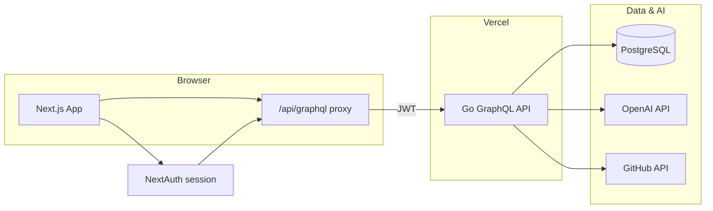

<p align="center">
  
</p>

<h1 align="center">Yuse</h1>

<p align="center">
  <strong>AI-native CV builder that grows with you.</strong><br />
  Build, tailor, and export resumes from a living career knowledge base — not a one-off template.
</p>

<p align="center">
  <a href="https://github.com/leoakok/yuse/blob/main/LICENSE"></a>
  <a href="https://nextjs.org"></a>
  <a href="https://go.dev"></a>
  <a href="https://www.postgresql.org"></a>
  <a href="https://vercel.com"></a>
</p>

<p align="center">
  <a href="https://yuse.ahmetkok.dev">Live demo</a>
  ·
  <a href="#quick-start">Quick start</a>
  ·
  <a href="#features">Features</a>
  ·
  <a href="CONTRIBUTING.md">Contributing</a>
  ·
  <a href="https://github.com/leoakok/yuse/issues">Issues</a>
</p>

---

## Why Yuse exists

Most CV tools treat your career as a static form. Yuse treats it as **knowledge that compounds** — a Digital Twin of your real work that gets sharper every time you chat, import a profile, or tailor for a role.

| | |
|---|---|
| **Why** | Every application deserves a CV that reflects who you actually are — not a generic one-pager. |
| **How** | A conversational AI assistant maintains structured career stories (STAR/PAR), imports from GitHub and LinkedIn, and tailors resumes per job. |
| **What** | A full-stack app: Next.js editor with live preview, Go GraphQL API, Postgres persistence, and print/PDF export. |

## Features

- **AI assistant** — Floating in-app agent that creates, edits, and tailors resumes through natural conversation and tool calls (OpenAI function calling + in-process MCP registry).
- **Digital Twin** — Long-term career knowledge separate from any single CV. Experience uses **STAR** (Situation → Task → Action → Result); projects and skills use **PAR** (Problem → Action → Result).
- **Resume workspace** — Live preview, reusable section library, themes, and per-resume visibility controls.
- **Job Tracker** — Track applications, research postings, generate tailored CVs and cover letters, and link them to tracked jobs.
- **Import sources**
  - **GitHub** — Optional OAuth connection for private repos and higher rate limits; public profile crawl when not connected.
  - **LinkedIn** — Profile import via `fetch_linkedin_profile` (server-side crawl).
  - **Websites & portfolios** — Deep crawl of personal sites, GitLab, and similar URLs.
- **Print & PDF** — Dedicated print view (`/print`) with browser print-to-PDF; vector PDF export via jsPDF.
- **Auth** — Google OAuth and email/password sign-in (NextAuth.js); GitHub OAuth for Connections.
- **Workspace-scoped data** — Per-user resumes, twin entries, and job applications in PostgreSQL.

> **Social images:** 4:3 cover and homepage preview assets live in [`public/social/`](public/social/). Upload `github-cover.png` as the repo social preview in GitHub settings.
>
> **Screenshots:** Product screenshots are not bundled in this repo yet. Run locally with `npm run start` and visit [http://localhost:3000](http://localhost:3000), or try the [live demo](https://yuse.ahmetkok.dev). Contributions of anonymized screenshots to `docs/screenshots/` are welcome.

## Tech stack

| Layer | Technology |
|-------|------------|
| Frontend | [Next.js 16](https://nextjs.org) (App Router), React 19, TypeScript, Tailwind CSS 4, shadcn/ui |
| Auth | [NextAuth.js v5](https://authjs.dev) (Google OAuth, credentials) |
| API | [Go](https://go.dev) + [gqlgen](https://github.com/99designs/gqlgen) GraphQL |
| Database | PostgreSQL 16 ([Neon](https://neon.tech) in production; Docker locally) |
| AI | OpenAI API (`gpt-5.4-mini` default; configurable fallbacks) |
| Agent tools | In-process MCP registry (`backend/internal/mcp`); optional stdio MCP server for Cursor |
| PDF | jsPDF (client-side vector export) + browser print |
| Deploy | [Vercel](https://vercel.com) — Next.js frontend + Go backend at `/_/backend` |

## Architecture



**Request flow:** The browser talks to `/api/graphql`, a Next.js route that signs a short-lived JWT and proxies to the Go backend. The assistant streams via `/api/assistant/stream`. GitHub and LinkedIn imports run server-side in the Go API.

## Prerequisites

- **Node.js** 20+
- **Docker Desktop** (Compose v2.1+ with `--wait`) for local Postgres + backend
- **OpenAI API key** (required for the CV assistant)
- **Google OAuth credentials** (required for sign-in — interactive setup script provided)

Optional: `gcloud` CLI for guided Google OAuth setup; Go 1.25+ if you run the backend outside Docker.

## Quick start

### 1. Clone and install

```bash
git clone https://github.com/leoakok/yuse.git
cd yuse
npm install
```

### 2. Configure auth (interactive)

```bash
npm run setup:auth
```

This creates `.env` and `backend/.env` from examples, generates `AUTH_SECRET`, and prompts for Google OAuth credentials.

### 3. Set your OpenAI key

Edit `backend/.env` and add:

```bash
OPENAI_API_KEY=sk-...
```

### 4. Start the full stack

```bash
npm run start
```

This builds and starts **Postgres** and the **Go backend** in Docker, waits for health checks, then runs the **Next.js dev server**.

| Service | URL |
|---------|-----|
| Frontend | http://localhost:3000 |
| GraphQL | http://localhost:8080/graphql |
| Playground | http://localhost:8080/playground |
| Postgres | `localhost:5432` |

### 5. Stop

```bash
npm run stop
```

To wipe the local database volume:

```bash
docker compose down --volumes
```

### Frontend only

If Postgres and the backend are already running:

```bash
npm run dev
```

### Backend only (without Docker)

```bash
cd backend
cp .env.example .env   # set DATABASE_URL, AUTH_SECRET, OPENAI_API_KEY
make run
```

See [docs/DOCKER.md](docs/DOCKER.md) and [docs/AUTH.md](docs/AUTH.md) for ports, OAuth redirect URIs, and troubleshooting.

## Environment variables

### Frontend (`.env`)

Copy from `.env.example`:

```bash
cp .env.example .env
```

| Variable | Required | Description |
|----------|----------|-------------|
| `AUTH_SECRET` | Yes | Session signing + proxy JWT secret (must match backend) |
| `GOOGLE_CLIENT_ID` | Yes | Google OAuth client ID |
| `GOOGLE_CLIENT_SECRET` | Yes | Google OAuth client secret |
| `NEXT_PUBLIC_GRAPHQL_URL` | Yes | Browser GraphQL endpoint (`/api/graphql`) |
| `GRAPHQL_URL` | Yes | Server-side upstream — absolute URL (`http://localhost:8080/graphql`) |
| `NEXTAUTH_URL` | No | App URL; inferred locally with `trustHost` |
| `BACKEND_PORT` | No | Docker backend port override (default `8080`) |
| `CORS_ORIGIN` | No | Frontend origin for backend CORS (default `http://localhost:3000`) |

### Backend (`backend/.env`)

Copy from `backend/.env.example`:

```bash
cp backend/.env.example backend/.env
```

| Variable | Required | Description |
|----------|----------|-------------|
| `DATABASE_URL` | Yes | PostgreSQL connection string |
| `AUTH_SECRET` | Yes | HS256 secret (must match frontend) |
| `OPENAI_API_KEY` | For assistant | OpenAI key; assistant errors without it |
| `OPENAI_MINI_MODEL` | No | Primary model (default `gpt-5.4-mini`) |
| `OPENAI_FALLBACK_MODEL` | No | Retry model if primary returns empty |
| `OPENAI_VISION_MODEL` | No | Vision model for image/PDF parsing |
| `PORT` | No | HTTP port (default `8080`) |
| `CORS_ORIGIN` | No | Allowed frontend origin |
| `GITHUB_CLIENT_ID` | For Connections | GitHub OAuth app client ID |
| `GITHUB_CLIENT_SECRET` | For Connections | GitHub OAuth app client secret |
| `GITHUB_TOKEN` | No | Fallback token for unauthenticated GitHub API |
| `GITHUB_OAUTH_CALLBACK_URL` | No | OAuth redirect (default `{CORS_ORIGIN}/api/auth/github/callback`) |
| `TAVILY_API_KEY` | No | Web search fallback (DuckDuckGo used when unset) |
| `LINKEDIN_PROFILE_API_URL` | No | Optional LinkedIn profile API endpoint |
| `LINKEDIN_PROFILE_API_KEY` | No | API key for LinkedIn profile service |
| `STORAGE_PROVIDER` | No | `azure` or `s3` (auto-detected from credentials when unset) |
| `AZURE_STORAGE_ACCOUNT` | For photo upload | Azure storage account name |
| `AZURE_STORAGE_ACCOUNT_KEY` | For photo upload | Azure storage account key |
| `AZURE_STORAGE_CONTAINER` | No | Blob container (default `profile-photos`) |
| `AZURE_STORAGE_PUBLIC_URL_PREFIX` | No | CDN URL prefix for uploaded photos |
| `AWS_REGION` | For S3 upload | S3 region for profile photo uploads (legacy) |
| `AWS_ACCESS_KEY_ID` | For S3 upload | S3 access key |
| `AWS_SECRET_ACCESS_KEY` | For S3 upload | S3 secret key |
| `AWS_S3_BUCKET` | For S3 upload | S3 bucket name |
| `AWS_S3_PUBLIC_URL_PREFIX` | No | CDN URL prefix for uploaded photos |

Never commit `.env` files or secrets. `npm run start` syncs `AUTH_SECRET` from the root `.env` into `backend/.env` automatically.

## Project structure

```
yuse/
├── src/                      # Next.js frontend
│   ├── app/                  # App Router pages and API routes
│   ├── components/
│   │   ├── ui/               # shadcn primitives
│   │   ├── cv/               # Resume editor, preview, grids
│   │   ├── agent/            # Assistant panel and status UI
│   │   ├── twin/             # Digital Twin workspace
│   │   └── landing/          # Marketing landing page
│   └── lib/
│       ├── api/cv-api.ts     # GraphQL client (use this from pages)
│       └── types/            # Shared TypeScript types
├── backend/                  # Go GraphQL API
│   ├── cmd/server/           # HTTP server entrypoint
│   ├── graph/                # GraphQL schema and resolvers
│   └── internal/
│       ├── mcp/              # Agent tool registry + stdio MCP server
│       ├── llm/              # OpenAI agent loop and prompts
│       └── cv/               # Resume and twin business logic
├── scripts/
│   ├── start.sh              # Docker Compose + Next.js dev
│   ├── stop.sh               # Stop containers
│   └── setup-google-oauth.sh # Interactive auth setup
├── docs/                     # AUTH, DOCKER, ROADMAP
├── public/                   # Static assets (logo, icons)
├── docker-compose.yml        # Local Postgres + backend
└── vercel.json               # Vercel frontend + Go backend routing
```

## Deployment

Production runs on **Vercel**:

- **Frontend** — Next.js at `/`
- **Backend** — Go service at `/_/backend` (see `vercel.json`)
- **Database** — [Neon](https://neon.tech) PostgreSQL

Live site: **[yuse.ahmetkok.dev](https://yuse.ahmetkok.dev)**

Set the same environment variables from the tables above in your Vercel project (frontend and backend services). Ensure `AUTH_SECRET` matches across services and `GRAPHQL_URL` points to the deployed backend GraphQL endpoint.

## Scripts reference

| Command | Description |
|---------|-------------|
| `npm run start` | Start Postgres + backend (Docker) and Next.js dev server |
| `npm run stop` | Stop Docker services (preserves DB volume) |
| `npm run setup:auth` | Interactive Google OAuth and `AUTH_SECRET` setup |
| `npm run dev` | Next.js dev server only |
| `npm run build` | Production frontend build |
| `npm run start:frontend` | Serve production frontend (`next start`) |
| `npm run lint` | ESLint |
| `cd backend && make run` | Run Go API locally |
| `cd backend && make test` | Go unit tests |
| `cd backend && make mcp-server` | Stdio MCP server for Cursor |

## Contributing

Contributions are welcome. Please read [CONTRIBUTING.md](CONTRIBUTING.md) for setup, code style, and the pull request checklist.

## Related documentation

- [docs/AUTH.md](docs/AUTH.md) — Authentication, OAuth, session invalidation
- [docs/DOCKER.md](docs/DOCKER.md) — Local Docker orchestration
- [docs/ROADMAP.md](docs/ROADMAP.md) — Product vision and phases
- [backend/README.md](backend/README.md) — GraphQL API details and example queries
- [backend/internal/mcp/README.md](backend/internal/mcp/README.md) — MCP tools and Cursor setup

## License

This project is licensed under the [MIT License](LICENSE).

Copyright © 2026 [Ahmet Kok](https://github.com/leoakok).
