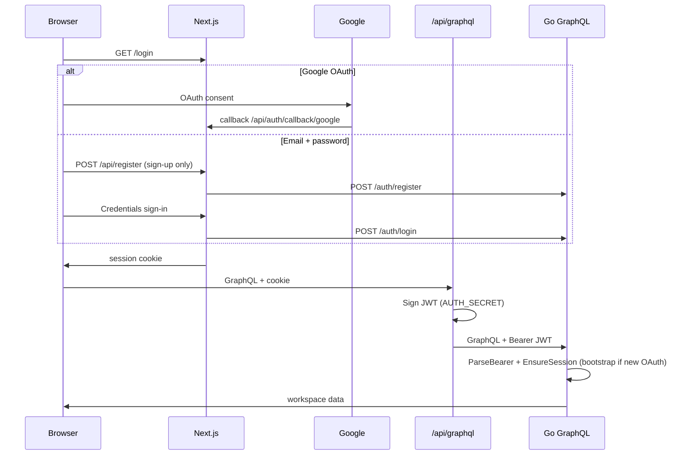

# Authentication

CV Builder uses **NextAuth.js** on the frontend and **HS256 JWTs** on the Go GraphQL API. Users can sign in with **Google OAuth** or **email and password**. New Google users are provisioned on the first API request after sign-in; email users are created at registration.

## Session invalidation

The browser keeps a **NextAuth JWT session cookie** independent of Postgres. If you wipe the database (or delete a user row), a stale cookie must not silently recreate the account.

- **Backend** (`store.EnsureSession`) returns **401** when the JWT is valid but the user row is missing and the request is not a fresh OAuth bootstrap (`bootstrap: "1"` in the proxy JWT, set only right after sign-in).
- **Frontend** (`WorkspaceProvider` / `graphqlRequest`) calls `signOut({ callbackUrl: '/login' })` on **401** from `/api/graphql`.
- **Fresh Google sign-in** still works: the first proxied request after OAuth includes `bootstrap`, which allows one-time user/workspace creation.

To fully reset locally: wipe Postgres **and** sign out (or clear site cookies) if you are testing auth edge cases.

## Sign-in options

| Method | Flow |
| ------ | ---- |
| Google | OAuth via NextAuth → session cookie → GraphQL proxy JWT |
| Email + password | Register on `/login` → bcrypt hash stored in Postgres → Credentials sign-in → same session/JWT shape |

Email users get stable IDs like `email-{uuid}` and workspaces `ws-{uuid}`. Google users keep `google-{googleId}` / `ws-{googleId}`.

## One-command setup

```bash
bash scripts/setup-google-oauth.sh
```

This script:

1. Creates `.env` and `backend/.env` from examples if missing
2. Generates `AUTH_SECRET` (`openssl rand -base64 32`) and syncs it to both env files
3. If `gcloud` is installed and authenticated, opens the OAuth client creation page for your project
4. Prompts for `GOOGLE_CLIENT_ID` and `GOOGLE_CLIENT_SECRET` and writes them to `.env`

Then start the app:

```bash
npm run start
```

Open [http://localhost:3000/login](http://localhost:3000/login) and sign in with Google or create an email account.

## Register / sign in with email

1. Open [http://localhost:3000/login](http://localhost:3000/login)
2. Click **Create an account**
3. Enter name (optional), email, password (min 8 characters), and confirm password
4. After registration you are signed in automatically

To sign in later, use **Sign in with email** on the same page.

Passwords are hashed with **bcrypt** (cost 12) in Postgres; plaintext passwords are never stored.

> **Rate limiting:** For production, add rate limiting on `/auth/login`, `/auth/register`, and `/api/register` (e.g. reverse proxy or middleware) to reduce brute-force attempts.

## Required environment variables


| Variable                  | Where                   | Purpose                                                   |
| ------------------------- | ----------------------- | --------------------------------------------------------- |
| `AUTH_SECRET`             | `.env` + `backend/.env` | NextAuth session signing + proxy JWT signing (must match) |
| `GOOGLE_CLIENT_ID`        | `.env`                  | Google OAuth client                                       |
| `GOOGLE_CLIENT_SECRET`    | `.env`                  | Google OAuth client                                       |
| `NEXTAUTH_URL`            | `.env` (optional)       | App URL (`http://localhost:3000`); inferred locally       |
| `NEXT_PUBLIC_GRAPHQL_URL` | `.env`                  | Browser GraphQL endpoint (`/api/graphql` proxy)           |
| `GRAPHQL_URL`             | `.env`                  | Server-side upstream, **must be absolute** (`http://localhost:8080/graphql`) |
| `DATABASE_URL`            | `backend/.env`          | Postgres (required for real per-user workspaces)          |


Copy templates:

```bash
cp .env.example .env
cp backend/.env.example backend/.env
```


## Manual Google Cloud Console steps

If you prefer the Console or `gcloud` is unavailable:

1. [Google Cloud Console → Credentials](https://console.cloud.google.com/apis/credentials)
2. **OAuth consent screen** → External → add your Google account as a test user
3. **Create credentials** → **OAuth client ID** → **Web application**
4. **Authorized redirect URI:** `http://localhost:3000/api/auth/callback/google`
5. Copy **Client ID** (the `….apps.googleusercontent.com` string) and **Client secret** into `.env` as `GOOGLE_CLIENT_ID` and `GOOGLE_CLIENT_SECRET`

Generate `AUTH_SECRET`:

```bash
openssl rand -base64 32
```

Set the same value in `.env` and `backend/.env`.

## How auth flows




- **Proxy** (`src/proxy.ts`) protects all routes except `/login`, `/api/auth/*`, and `/api/register`.
- **GraphQL proxy** (`src/app/api/graphql/route.ts`) requires a signed-in session and forwards a short-lived JWT.
- **Backend** (`backend/cmd/server/main.go`) validates the JWT, ensures the user exists in Postgres (`store.EnsureSession`), and scopes all queries to that workspace. Deleted users with a stale cookie get **401** unless the request is an OAuth bootstrap.
- **Auth API** (`POST /auth/register`, `POST /auth/login`) handles email account creation and credential verification.


## Google Cloud MCP (Cursor)

Official Google Cloud **remote** MCP servers do not work in Cursor as of June 2026 (OAuth redirect URI mismatch). See [Google Cloud MCP release notes](https://cloud.google.com/mcp/release-notes).

This repo includes a **local** GCP MCP template for infrastructure tasks (not OAuth client creation):

```json
// .cursor/mcp.json
{
  "mcpServers": {
    "gcp": {
      "command": "npx",
      "args": ["-y", "gcp-mcp-server@1.4.0"]
    }
  }
}
```

**Enable in Cursor:** Settings → Features → MCP Servers → toggle `gcp` on.

**Prerequisites:**

```bash
# Install Google Cloud SDK, then:
gcloud auth login
gcloud auth application-default login
gcloud config set project YOUR_PROJECT_ID
```

`gcp-mcp-server` manages GCP resources (Compute, Storage, BigQuery, etc.). **OAuth 2.0 Web client IDs must still be created in the Console** (or via `scripts/setup-google-oauth.sh`).

## Troubleshooting


| Symptom                       | Fix                                                                         |
| ----------------------------- | --------------------------------------------------------------------------- |
| Redirect URI mismatch         | Redirect must be exactly `http://localhost:3000/api/auth/callback/google`   |
| `Unauthorized` from GraphQL   | Ensure `AUTH_SECRET` matches in `.env` and `backend/.env`; restart backend  |
| `POST /api/graphql` 500/503   | Set `GRAPHQL_URL=http://localhost:8080/graphql` (absolute URL, not `/api/graphql`); ensure backend is up (`curl http://localhost:8080/healthz`) |
| Google `error=Configuration`  | Set `GOOGLE_CLIENT_ID`, `GOOGLE_CLIENT_SECRET`, and `AUTH_SECRET` in `.env`; restart dev server after env changes |
| Google `fetch failed`         | Usually network/OIDC discovery timeout; explicit Google endpoints are configured in `src/auth.ts`, also check internet access |
| Empty workspace after sign-in | Confirm `DATABASE_URL` is set and Postgres is running (`docker compose ps`) |
| Google "access blocked"       | Add your account under OAuth consent screen → Test users                    |
| Stale data from another user  | Wipe Postgres volume: `docker compose down --volumes` and sign in again     |
| Email already registered      | Sign in instead, or use a different email                                   |
| Google sign-in blocked for email | That address was registered with email/password, use email sign-in instead |
| Password too short            | Use at least 8 characters                                                   |


## Database migration

Email/password auth adds migration `000006_email_password.up.sql`:

- `users.password_hash` (nullable, Google-only users have no password)
- unique index on `LOWER(email)`

Migrations run automatically when the backend starts. After pulling this change, rebuild the backend container:

```bash
docker compose up -d --build backend
```

Or restart locally with `make run` in `backend/`.


## Production notes

- Set `AUTH_SECRET` to a strong random value; never commit `.env`
- Add your production URL to Google OAuth authorized redirect URIs: `https://YOUR_DOMAIN/api/auth/callback/google`
- Set `CORS_ORIGIN` in `backend/.env` to your frontend origin

